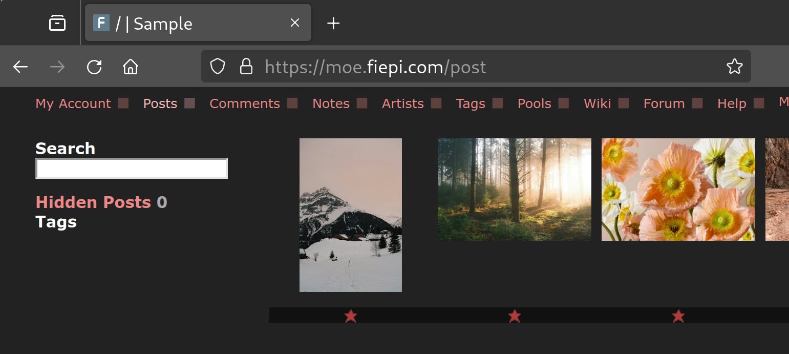
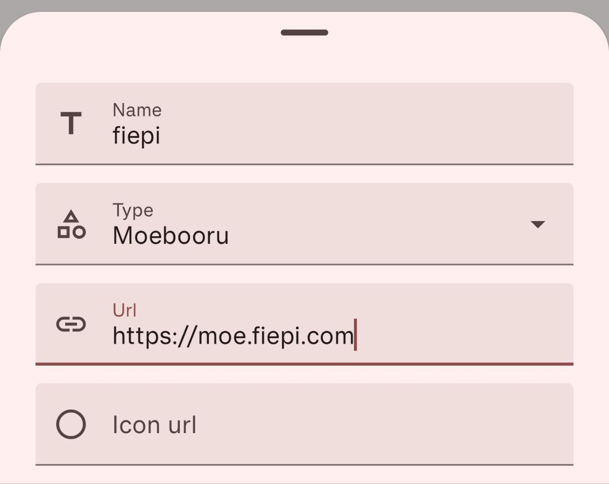

### BooruHub Usage Instructions

Once you've installed BooruHub, you need to connect it to your Booru imageboard server. BooruHub can be connected to both public and private imageboards. For instance, you can use open-source platforms like [Danbooru](https://github.com/danbooru/danbooru) or [Moebooru](https://github.com/moebooru/moebooru) to build your own image hosting service. These platforms provide a robust and customizable solution for managing large collections of images.

## Booru Root URL
The main parameter you need to enter is the Booru root URL. This URL serves as the primary address through which BooruHub communicates with your imageboard server. For example, if your server's root URL is `https://moe.fiepi.com`, you would enter this into BooruHub:

### Important Considerations
When you copy or manually type the root URL, make sure to include the `http://` or `https://` part as well. This is crucial because it tells the BooruHub app whether to use a secure (HTTPS) or an unsecured (HTTP) connection. Failing to include this can lead to connection issues and prevent the app from functioning correctly.

## Example Configuration
To help you get started, here is an example configuration screen:

In this example, you can see how the root URL is properly entered. Ensure that your settings match this format for optimal performance.

### Identifying Your Booru Server Type
It is important to determine whether your Booru server is based on Danbooru or Moebooru, as this affects how you configure BooruHub.

- **Danbooru**: Typically, Danbooru-based servers have a URL structure and API that follow the standard Danbooru framework. You can check the server documentation or look for specific Danbooru identifiers in the URL or API responses.
- **Moebooru**: Moebooru is a fork of Danbooru, and while it shares many similarities, it has its own unique features and API endpoints. Moebooru-based servers may have specific references to Moebooru in their documentation or interface.

### Selecting the Correct Category in BooruHub
Once you have identified whether your server is Danbooru or Moebooru, you need to select the corresponding category in BooruHub. This ensures that the app communicates correctly with your server.

1. **Open BooruHub** and navigate to the configuration settings.
2. **Enter the Booru Root URL** as described above.
3. **Select the Server Type**:
   - If your server is Danbooru-based, choose the "Danbooru" option.
   - If your server is Moebooru-based, choose the "Moebooru" option.

This selection is crucial for ensuring proper API interactions and feature compatibility.

### Connecting to Your Booru Server
If your Booru server is accessible from a phone browser, the BooruHub app should connect without issues. Here are some additional tips to ensure a smooth connection:

1. **Local Network Access**: If your server is only accessible from a local network, such as your home Wi-Fi, ensure that your phone is connected to the same network. This is often necessary for private servers that are not exposed to the wider internet.
2. **Self-Signed SSL Certificates**: If you use a self-signed SSL certificate for your server, you will need to install this certificate on your phone. This can usually be done through the security settings of your device. Self-signed certificates are common in private and development environments but require this extra step for compatibility.
3. **Public vs. Private Servers**: Whether you are connecting to a public or private server, the steps remain largely the same. However, private servers may have additional security measures, such as login requirements or IP restrictions, that you will need to configure appropriately.

### Troubleshooting Tips
If you encounter issues connecting to your Booru server, consider the following troubleshooting steps:

- **Double-Check the URL**: Ensure that the root URL is correctly entered, including the `http://` or `https://` prefix.
- **Network Connectivity**: Verify that your device is connected to the correct network, especially for local servers.
- **Certificate Installation**: If using a self-signed certificate, make sure it is properly installed on your device.
- **Server Status**: Ensure that your Booru server is running and accessible through a web browser.

By following these instructions, you should be able to set up and use BooruHub effectively with your Booru imageboard server. Enjoy managing your image collections with ease!
